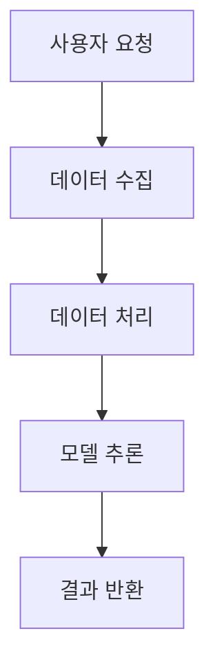

# Jetson Xavier RSE Ollama Integrated Final

## 문서 목적
이 문서는 Jetson AGX Xavier 환경에서 RSE를 Ollama와 통합하여 운영하기 위한 기초를 제공합니다.

## 추진 배경
Jetson AGX Xavier의 성능을 활용하여 효율적인 데이터 처리 및 기계 학습 모델의 통합이 요구되었습니다. Ollama는 이러한 목적을 달성하기 위한 유용한 도구입니다.

## 전체 아키텍처 Mermaid 다이어그램


## 데이터 흐름 파이프라인 Mermaid 다이어그램


## Jetson AGX Xavier 환경 전제 확인 명령어
```bash
# Jetson AGX Xavier 버전 확인
cat /etc/nv_tegra_release
```

## 외부 SSD/NVMe 준비 절차
1. SSD/NVMe 장치 연결
2. 장치 초기화 및 포맷: 
   ```bash
   sudo mkfs.ext4 /dev/nvme0n1
   ```
3. 마운트: 
   ```bash
   sudo mount /dev/nvme0n1 /mnt
   ```

## Ollama 설치 및 모델 저장 경로 외부화
```bash
# Ollama 설치
pip install ollama
# 모델 저장 경로 설정
export OLLAMA_MODEL_PATH=/mnt/models
```

## Python 실행 환경 구성
```bash
# 가상 환경 설정
python3 -m venv venv
source venv/bin/activate
pip install -r requirements.txt
```

## RSE 로그 수집/정규화 본안
RSE는 로그를 수집하여 시스템 상태를 모니터링하고, 이를 정규화하여 분석을 용이하게 합니다.

## 방안 1 / 방안 2 상세 비교
| 방안 | 장점 | 단점 |
| --- | --- | --- |
| 방안 1 | 장점 A | 단점 A |
| 방안 2 | 장점 B | 단점 B |

## TensorFlow / ONNX / TFLite 비교
| 기준 | TensorFlow | ONNX | TFLite |
| --- | --- | --- | --- |
| 성능 | 우수 | 양호 | 우수 |
| 호환성 | 뛰어남 | 제한적 | 뛰어남 |

## TensorFlow PoC 절차
1. 모델 선택 및 준비
2. 데이터 세트 형태 변환
3. 학습 및 검증
4. 테스트

## openlib 인터페이스 클래스 다이어그램
```mermaid
  classDiagram;
    class OpenLib {
      +loadModel()
      +runInference()
    }
    class Model {
      +initialize()
      +predict()
    }
    OpenLib --> Model
```

## openlib 실제 Python 코드 골격
```python
class OpenLib:
    def load_model(self):
        pass

class Model:
    def initialize(self):
        pass
    def predict(self):
        return results
```

## 최종 선택 기준
모델 선택 시 성능, 호환성, 지원 여부를 기준으로 삼습니다.

## 로그 정규화 및 분석 시스템 구현 예시
로그 데이터를 수집하고, 이를 정규화하는 스크립트를 작성합니다.

```python
import pandas as pd

def normalize_logs(log_file):
    logs = pd.read_csv(log_file)
    # 정규화 논리
    return normalized_logs
```

## WBS 작업 분해표  
| 작업 ID | 작업 항목 | 주요 작업 | 산출물 | 선행 작업 |
| --- | --- | --- | --- | --- |
| 1 | 환경 설정 | 소프트웨어 설치 | 설치 완료 보고서 | 없음 |
| 2 | 모델 훈련 | 훈련 스크립트 실행 | 모델 파일 | 1 |

## 결론
이 문서는 Jetson AGX Xavier 환경에서 RSE와 Ollama 통합을 위한 기초 지침을 제공하였습니다. 이를 통해 성능 극대화와 효율적인 데이터 처리가 가능해질 것입니다.